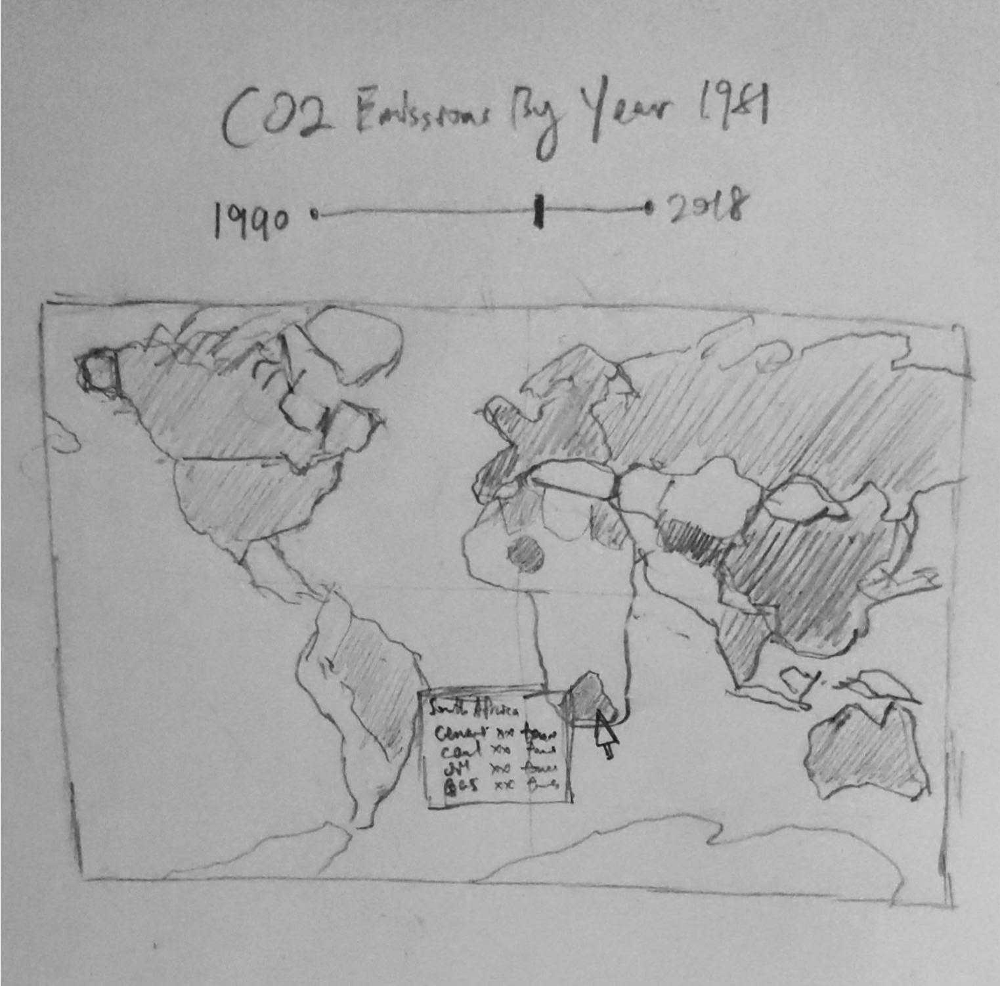

# CO2 Emissions Challenge

For this Frontend challenge, we'd like you to implement a react app that visualizes historical CO2 emissions by country. The user should also be able to browse the emissions data over different years. You will find the useful links helpful to get started.

---

Some high-level requirements:

* User can view a world map with an visual overview CO2 emissions
* User can navgiate between years and the data should update accordingly

Bonus objective to allow detailed inspection of CO2 emission by type within a country.

* User can select individual countries to see the corresponding CO2 emissions breakdown

---

### Getting Started

1. Ensure node & npm are installed
2. Create a react starter app following documentation in useful links
3. Read through examples in `react-simple-maps` and its relevant documentation
4. Add a choropleth world map to the application
5. Download CO2 data from `owid`, either csv or json subject to implementation
6. Update the world map to load CO2 data instead (fixed year)
7. Use a slider component from `material-ui` to allow user to select different years
8. Polish the UI so that it looks nice
9. BONUS: Add pop-over info-boxes on hover or click per country

---

### Useful Links

* UI Components: https://material-ui.com/ , for slider UI component
* CO2 Data: https://github.com/owid/co2-data , for raw CO2 data csv/json
* Mapping Library: https://www.react-simple-maps.io/ , for rendering world map
* React Starter App: https://reactjs.org/docs/create-a-new-react-app.html

### Mockup
